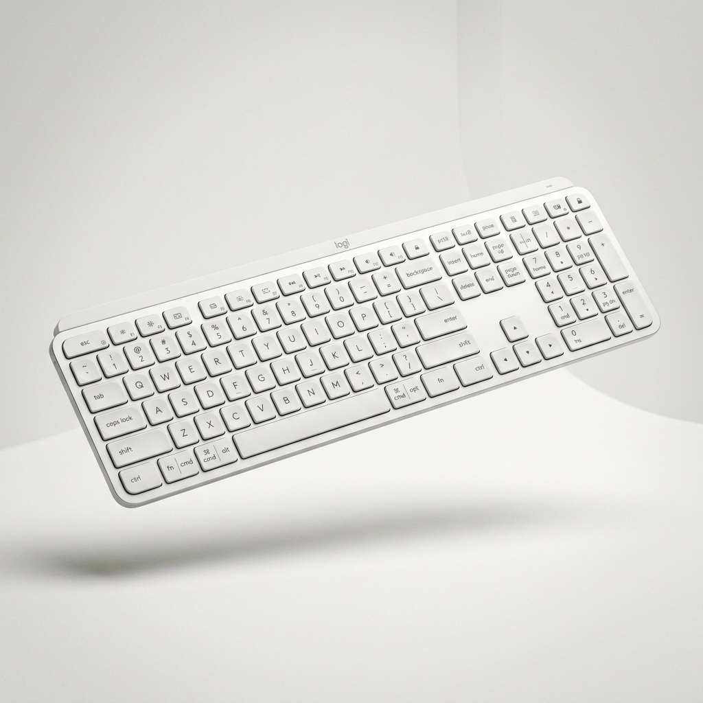

<div align="center">

# ⌨️ Logitech K950 — landing conceito

**Página de produto com vídeo controlado pela rolagem.**

[](https://augustodonateli.github.io/conceito-logitech-k950/)




</div>

---

> Projeto de estudo, sem relação com a Logitech. Nome e produto são usados só como tema.

## A ideia

Landing de produto no estilo das páginas da Apple: conforme você rola, o vídeo do
teclado avança quadro a quadro, e as seções de recursos e especificações entram em
seguida.

## Como funciona

- **`js/video-scroll.js`** liga a posição da rolagem ao `currentTime` do vídeo.
- Só calcula quando o vídeo está visível na tela e ignora mudanças mínimas, o que
  reduz o trabalho no celular.
- O vídeo é pré-carregado para a busca de quadros não travar.
- Layout em Tailwind, responsivo do celular ao desktop.

## Rodando localmente

O vídeo precisa ser servido por HTTP para a rolagem funcionar (abrir o arquivo
direto no navegador não deixa buscar quadros):

```bash
python -m http.server 8000
# abra http://localhost:8000
```

---

<div align="center">

Feito por [Augusto Donateli](https://github.com/AugustoDonateli)

</div>
